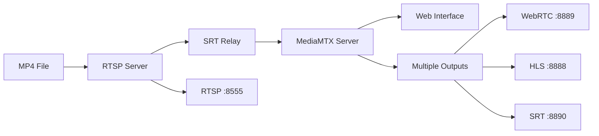

# Paladium Video Pipeline

A video streaming pipeline that converts MP4 files to RTSP, then to SRT, and serves multiple output formats (WebRTC, HLS, SRT). Fully containerized with Docker for zero-dependency deployment.

## Architecture



## Quick Start

### Prerequisites
- Docker and Docker Compose
- VLC Media Player (for testing streams)

### One-Command Demo
```bash
make docker-demo
```

The system will automatically build, start all services, and show access URLs.

### Available Commands
```bash
make docker-build    # Build all images
make docker-up       # Start all services  
make docker-down     # Stop all services
make docker-logs     # View logs
make docker-clean    # Clean all resources

# Local development (requires GStreamer + C++23 compiler)
make build           # Build locally
make start          # Start locally
make stop           # Stop all
```

## Access Points

| Service | URL | Description |
|---------|-----|-------------|
| **Web Interface** | http://localhost:8080 | HLS & WebRTC playback |
| **RTSP (VLC)** | rtsp://localhost:8555/cam1 | Direct RTSP stream |
| **SRT (VLC)** | srt://localhost:9998?streamid=read:cam1 | SRT stream |
| **HLS** | http://localhost:8888/cam1/index.m3u8 | HLS playlist |
| **MediaMTX API** | http://localhost:9997 | Server API |
| **Metrics** | http://localhost:9996/metrics | Prometheus metrics |

## Project Structure

```
paladium/
├── Makefile                    # Main commands
├── docker-compose.yml          # Docker orchestration
├── pipeline-rtsp/              # Pipeline 1: MP4 → RTSP
├── pipeline-rtsp-to-srt/       # Pipeline 2: RTSP → SRT  
├── server/                     # Pipeline 3: MediaMTX + Web UI
├── media/sample.mp4            # Test video
└── docker/healthcheck/         # Health monitoring
```

## Monitoring

**Docker Health Checks:**
```bash
docker-compose ps              # Service status
make docker-logs              # Live logs
```

**API Endpoints:**
- Health: `curl http://localhost:9997/v3/paths/list`
- Stream Info: `curl http://localhost:9997/v3/paths/get/cam1`
- Web Interface: http://localhost:8080

## Features

- **Zero Dependencies**: Fully containerized with Docker
- **Multi-Protocol Output**: WebRTC, HLS, SRT, RTSP
- **Automatic Recovery**: Health checks with restart on failure
- **Single Command Deploy**: `make docker-demo` starts everything

## Troubleshooting

**Services not starting:**
```bash
make docker-logs              # Check logs
docker-compose ps             # Check status
make docker-clean docker-up   # Clean restart
```

**Port conflicts:**
```bash
lsof -i :8555     # RTSP Server
lsof -i :8080     # Web UI
lsof -i :9998     # SRT (read+publish)
```

**Stream not playing:**
```bash
# Test individual services
curl http://localhost:9997/v3/paths/list          # MediaMTX health
curl http://localhost:8888/cam1/index.m3u8        # HLS availability
```

**Metrics & Health:**
```bash
curl -sf http://localhost:9997/v3/paths/list    # API health
curl -sf http://localhost:9996/metrics | head   # Metrics
```

## How It Works

1. **Pipeline 1**: Serves MP4 file as RTSP stream
2. **Pipeline 2**: Converts RTSP to SRT with automatic reconnection  
3. **Pipeline 3**: MediaMTX server converts SRT to WebRTC/HLS/SRT outputs
4. **Web Interface**: Browser-based player for WebRTC and HLS streams

## Development

For local development:
```bash
# Install dependencies  
brew install gstreamer pkgconf

# Build and run locally
make build
make start
```

---

**Quick Test:** After running `make docker-demo`, open http://localhost:8080 and click "Play HLS" or "Play WebRTC" to see your video stream!